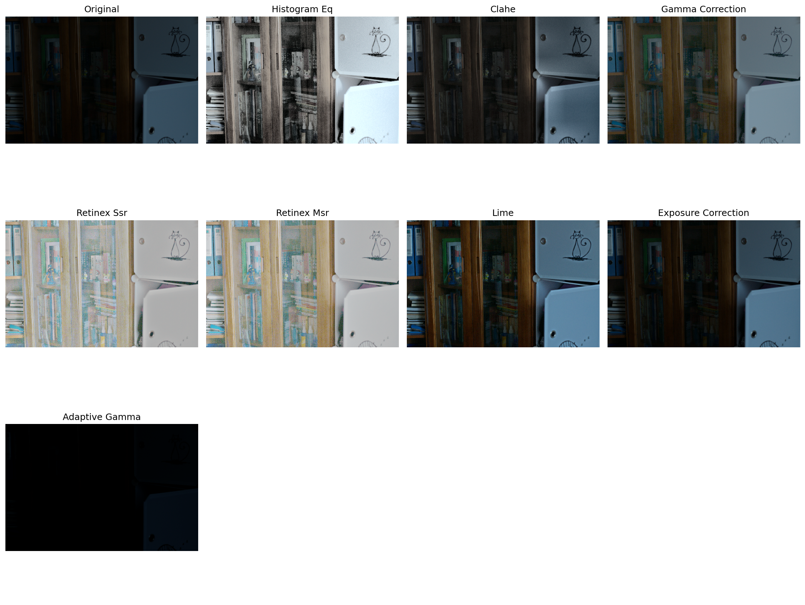

# Semantic-Guided-Low-Light-Image-Enhancement

* Base Paper [Semantic-Guided Zero-Shot Learning for Low-Light Image/Video Enhancement](http://arxiv.org/abs/2110.00970)
* Dataset can be found in [data/](data/)
* Traditional models source can be found in [traditional_model](traditional_model/)

## Abstract
Low-light images present significant challenges to both human perception and computer vision algorithms. It is crucial for algorithms to be robust in enlightening low-light images, which is essential for computational photography and various computer vision applications, such as real-time detection and segmentation.

A **semantic-guided zero-shot low-light enhancement network (SGZ)** is proposed, which is trained without the need for paired images, unpaired datasets, or segmentation annotations.

The method involves three key stages:
1.  An **enhancement factor extraction network**, designed using depthwise separable convolution, is employed for an efficient estimate of the pixel-wise light deficiency in a low-light image.
2.  A **recurrent image enhancement network** is proposed to progressively enhance the low-light image while maintaining an affordable model size.
3.  An **unsupervised semantic segmentation network** is introduced for preserving semantic information during intensive image enhancement.


## Model's Architecture


## Model's Inference
### Qualitative analysis:
#### Traditional models:

#### DL model:
<p>
    
    
</p>

### Quantitative analysis:

| Method              | Avg Time (s) | Speed  | Quality | Memory | Complexity |
|---------------------|--------------|--------|---------|--------|------------|
| Histogram EQ        | ⭐⭐⭐⭐⭐ | ⭐⭐      | ⭐⭐⭐⭐⭐  | ⭐          |
| CLAHE               | ⭐⭐⭐⭐  | ⭐⭐      | ⭐⭐⭐⭐   | ⭐⭐         |
| Gamma Correction    | ⭐⭐⭐⭐⭐ | ⭐⭐⭐     | ⭐⭐⭐⭐⭐  | ⭐          |
| Retinex SSR         | ⭐⭐⭐   | ⭐⭐      | ⭐⭐⭐    | ⭐⭐⭐        |
| Retinex MSR         | ⭐⭐    | ⭐⭐⭐     | ⭐⭐     | ⭐⭐⭐        |
| LIME                | ⭐⭐⭐   | ⭐⭐⭐⭐    | ⭐⭐⭐    | ⭐⭐⭐        |
| Exposure Correction | ⭐⭐⭐⭐⭐ | ⭐       | ⭐⭐⭐⭐⭐  | ⭐          |
| Adaptive Gamma      | ⭐⭐⭐⭐  | ⭐       | ⭐⭐⭐⭐   | ⭐⭐         |
| DL Model            | ⭐     | ⭐⭐⭐⭐⭐   | ⭐⭐     | ⭐⭐⭐⭐⭐      |


### More samples can be found in
* Sample Low-light images: [test_input/](test_input/)
* Sample Low-light Enhanced images [test_output/](test_output/)

---

# Get Started

## 1. Requirements
* CUDA 10.0
* Python 3.6+
* Pytorch 1.0+
* torchvision 0.4+
* opencv-python
* numpy
* pillow
* scikit-image

## 2. Dataset
```
data/
├── test_data/
│   ├── lowCUT/
│   ├── BDD/
│   ├── Cityscapes/
│   ├── DICM/
│   ├── LIME/
│   ├── LOL/
│   ├── MEF/
│   ├── NPE/
│   └── VV/
└── train_data/
    └── ...
```

## 3. Training from Scratch
To train the model:
```
python train.py \
  --lowlight_images_path path/to/train_images \
  --snapshots_folder path/to/save_weights
```

Example (train from scratch):
```
python train.py \
  --lowlight_images_path data/train_data \
  --snapshots_folder weight/
```

## 4. Resume Training

To resume training from a checkpoint:
```
python train.py \
  --lowlight_images_path path/to/train_images \
  --snapshots_folder path/to/save_weights \
  --load_pretrain True \
  --pretrain_dir path/to/checkpoint.pth
```

Example (resume from Epoch99.pth):
```
python train.py \
  --lowlight_images_path data/train_data \
  --snapshots_folder weight/ \
  --load_pretrain True \
  --pretrain_dir weight/Epoch99.pth
```

 
## 5. Testing

To test the model:
```
python test.py \
  --input_dir path/to/your_input_images \
  --weight_dir path/to/pretrained_model.pth \
  --test_dir path/to/output_folder 
```

Example:
```
python test.py \
  --input_dir data/test_data/lowCUT \
  --weight_dir weight/Epoch99.pth \
  --test_dir test_output
```


# Hyperparameters
| Name                 | Type  | Default            | 
|----------------------|-------|--------------------|
| lowlight_images_path | str   | data/train_data/   |         
| lr                   | float | 1e-3               |          
| weight_decay         | float | 1e-3               |            
| grad_clip_norm       | float | 0.1                |            
| num_epochs           | int   | 100                |          
| train_batch_size     | int   | 6                  |          
| val_batch_size       | int   | 8                  |           
| num_workers          | int   | 4                  |         
| display_iter         | int   | 10                 |         
| snapshot_iter        | int   | 10                 |        
| scale_factor         | int   | 1                  |         
| snapshots_folder     | str   | weight/            |         
| load_pretrain        | bool  | False              |       
| pretrain_dir         | str   | weight/Epoch99.pth |         
| num_of_SegClass      | int   | 21                 |        
| conv_type            | str   | dsc                |        
| patch_size           | int   | 4                  |        
| exp_level            | float | 0.6                |       


