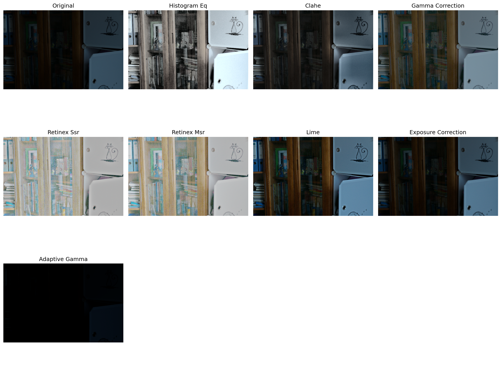

# Traditional Low-Light Image Enhancement Models

This directory contains implementations of traditional (non-deep learning) methods for low-light image enhancement, as referenced in the paper "Semantic-Guided Zero-Shot Learning for Low-Light Image/Video Enhancement".

## Implemented Methods

### 1. Histogram Equalization (HE)
- **Description**: Classic method that redistributes pixel intensities to improve contrast
- **Implementation**: Applied to luminance channel in YUV color space
- **Pros**: Simple, fast, good for global contrast enhancement
- **Cons**: Can cause over-enhancement and loss of natural appearance

### 2. Contrast Limited Adaptive Histogram Equalization (CLAHE)
- **Description**: Improved version of histogram equalization with local adaptation
- **Implementation**: Applied to L channel in LAB color space with clip limit
- **Pros**: Better local contrast, reduces over-enhancement
- **Cons**: Can introduce artifacts in smooth regions

### 3. Gamma Correction
- **Description**: Power-law transformation to adjust brightness
- **Implementation**: Fixed gamma (0.5) and adaptive gamma based on image statistics
- **Pros**: Simple, preserves color relationships
- **Cons**: Global operation, may not handle varying illumination well

### 4. Single Scale Retinex (SSR)
- **Description**: Based on Retinex theory for color constancy and lightness perception
- **Implementation**: log(I) - log(I*G) where G is Gaussian blur
- **Pros**: Good color preservation, handles illumination variations
- **Cons**: Can introduce halos around edges

### 5. Multi Scale Retinex (MSR)
- **Description**: Combines multiple SSR results with different scales
- **Implementation**: Average of SSR with sigmas [15, 80, 250]
- **Pros**: Better balance between local and global enhancement
- **Cons**: More computationally expensive than SSR

### 6. LIME Enhancement
- **Description**: Low-light Image Enhancement via Illumination Map Estimation
- **Implementation**: Estimates illumination map and enhances based on it
- **Pros**: Preserves natural appearance, good for non-uniform illumination
- **Cons**: May not enhance very dark regions sufficiently

### 7. Exposure Correction
- **Description**: Simple linear scaling of pixel intensities
- **Implementation**: Multiply by exposure factor (default 1.5)
- **Pros**: Very fast, simple
- **Cons**: Can cause saturation, doesn't handle noise well

### 8. Adaptive Gamma Correction
- **Description**: Gamma correction with parameter adapted to image statistics
- **Implementation**: Gamma = -log2(mean_intensity), clipped to [0.3, 2.5]
- **Pros**: Automatically adapts to image brightness
- **Cons**: Still a global operation

## Model's Inference


### More samples can be found in
* Sample Low-light images: [test_input/](test_input/)
* Sample Low-light Enhanced images [test_output/](test_output/)


## Research Context

Based on the paper analysis, these traditional methods represent the state-of-the-art before deep learning approaches. The paper specifically mentions:

- **Histogram Equalization** [17, 44] - Classic approach
- **Retinex Theory** [24, 47, 8, 9, 13] - Human vision-inspired methods
- **LIME** [6] - Modern traditional approach
- **Various enhancement techniques** - Comprehensive comparison baseline

## Performance Characteristics
| Method              | Avg Time (s) | Speed  | Quality | Memory | Complexity |
|---------------------|--------------|--------|---------|--------|------------|
| Histogram EQ        | 0.0012       | ⭐⭐⭐⭐⭐ | ⭐⭐      | ⭐⭐⭐⭐⭐  | ⭐          |
| CLAHE               | 0.0064       | ⭐⭐⭐⭐  | ⭐⭐      | ⭐⭐⭐⭐   | ⭐⭐         |
| Gamma Correction    | 0.0114       | ⭐⭐⭐⭐⭐ | ⭐⭐⭐     | ⭐⭐⭐⭐⭐  | ⭐          |
| Retinex SSR         | 0.1220       | ⭐⭐⭐   | ⭐⭐      | ⭐⭐⭐    | ⭐⭐⭐        |
| Retinex MSR         | 2.9197       | ⭐⭐    | ⭐⭐⭐     | ⭐⭐     | ⭐⭐⭐        |
| LIME                | 0.0278       | ⭐⭐⭐   | ⭐⭐⭐⭐    | ⭐⭐⭐    | ⭐⭐⭐        |
| Exposure Correction | 0.0009       | ⭐⭐⭐⭐⭐ | ⭐       | ⭐⭐⭐⭐⭐  | ⭐          |
| Adaptive Gamma      | 0.0185       | ⭐⭐⭐⭐  | ⭐       | ⭐⭐⭐⭐   | ⭐⭐         |


## Performance Comparison
```
==================================================
EXPERIMENT SUMMARY
==================================================
histogram_eq        : 0.0012s avg, 64 images
clahe               : 0.0064s avg, 64 images
gamma_correction    : 0.0114s avg, 64 images
retinex_ssr         : 0.1220s avg, 64 images
retinex_msr         : 2.9197s avg, 64 images
lime                : 0.0278s avg, 64 images
exposure_correction : 0.0009s avg, 64 images
adaptive_gamma      : 0.0185s avg, 64 images
```

## Comparison with Deep Learning Methods

These traditional methods serve as baselines for comparison with the main deep learning approach in this repository. Key differences:

**Traditional Methods:**
- ✅ Fast processing
- ✅ No training required
- ✅ Interpretable parameters
- ❌ Limited adaptability
- ❌ May not handle complex scenarios well

**Deep Learning (Main Model):**
- ✅ Better perceptual quality
- ✅ Handles complex illumination
- ✅ Semantic-aware enhancement
- ❌ Requires training
- ❌ Slower inference
- ❌ Less interpretable

## References

1. **Histogram Equalization**: Gonzalez, R.C. and Woods, R.E., 2017. Digital image processing.
2. **CLAHE**: Zuiderveld, K., 1994. Contrast limited adaptive histogram equalization.
3. **Retinex Theory**: Land, E.H. and McCann, J.J., 1971. Lightness and retinex theory.
4. **LIME**: Guo, X., Li, Y. and Ling, H., 2016. LIME: Low-light image enhancement via illumination map estimation.

---

## Usage

```bash
# Run all methods on a dataset
python traditional_models_experiment.py \
    --input_dir test_input \
    --output_dir test_output

# Run specific methods only
python traditional_models_experiment.py \
    --input_dir test_input \
    --output_dir test_output \
    --methods histogram_eq clahe gamma_correction

# Create comparison grid for single image
python traditional_models_experiment.py \
    --comparison_image path/to/image.jpg \
    --comparison_output comparison.png
```


## Requirements

Install the required packages:

```bash
pip install opencv-python numpy matplotlib scipy scikit-image pillow
```

## Output Structure

```
traditional_results/
├── histogram_eq/
│   ├── image1_histogram_eq.jpg
│   └── image2_histogram_eq.jpg
├── clahe/
│   ├── image1_clahe.jpg
│   └── image2_clahe.jpg
├── gamma_correction/
├── retinex_ssr/
├── retinex_msr/
├── lime/
├── exposure_correction/
└── adaptive_gamma/
```
